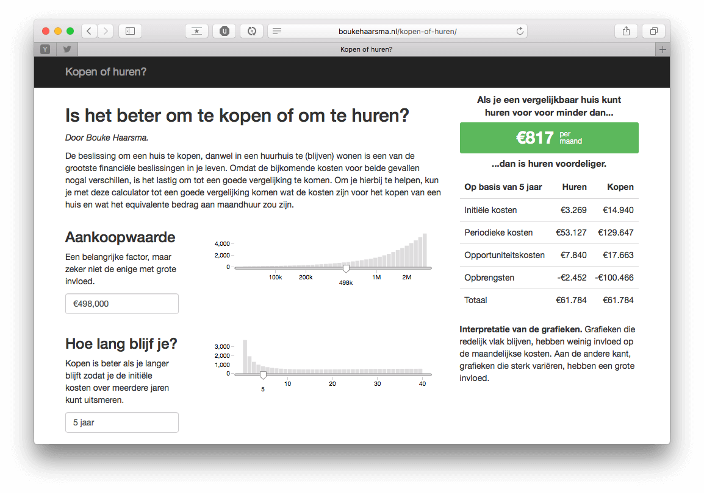

# Kopen of huren

De beslissing om een huis te kopen, danwel in een huurhuis te (blijven) wonen is een van de grootste financiële beslissingen in je leven. Omdat de bijkomende kosten voor beide gevallen nogal verschillen, is het lastig om tot een goede vergelijking te komen. Om je hierbij te helpen, kun je met deze calculator tot een goede vergelijking komen wat de kosten zijn voor het kopen van een huis en wat het equivalente bedrag aan maandhuur zou zijn.

De brongegevens zijn voor het laatst geüpdatet in 2015.

## Development

To enable livereload and run a HTTP server:

    python -c "from livereload import Server;server=Server();server.serve(port=8000,host='0.0.0.0')"
